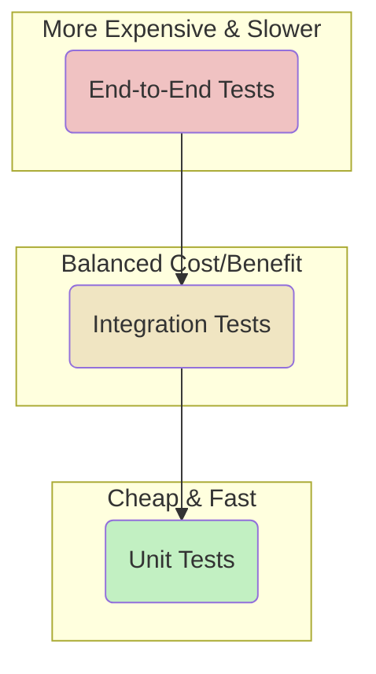

# 3.2 Testing Strategy

This document outlines the testing philosophy, strategies, and tools used in this project to ensure code quality, reliability, and prevent regressions.

## Guiding Philosophy: The Testing Pyramid

We follow the principles of the testing pyramid. Our efforts are balanced across different types of tests to maximize effectiveness while minimizing cost and execution time.



-   **Unit Tests (Most Numerous)**: These form the base of our pyramid. They are fast, isolated, and cheap to write. They test individual functions, components, or classes in isolation.
-   **Integration Tests**: These test how different parts of the application work together. For example, testing an API route to ensure it correctly calls a repository and returns the expected data.
-   **End-to-End (E2E) Tests (Fewest)**: These are the most expensive and slowest tests. They simulate real user workflows in a browser. We use them sparingly to cover critical user paths.

## Tools

-   **Test Runner**: [Vitest](https://vitest.dev/) is our primary test runner, chosen for its speed and Jest-compatible API.
-   **React Testing**: We use [@testing-library/react](https://testing-library.com/docs/react-testing-library/intro/) for testing React components. This encourages testing from a user's perspective.
-   **Mocking**: We use Vitest's built-in mocking capabilities (`vi.mock`) to isolate components for unit tests.

## Unit Testing

-   **Location**: Test files are co-located with the source files, using the `*.test.ts` or `*.test.tsx` extension (e.g., `my-function.test.ts`).
-   **What to Test**:
    -   Utility functions.
    -   Complex business logic in server-side services.
    -   Individual React components with mocked props and dependencies. The goal is to test the component's rendering and behavior, not its dependencies.
    -   Repository functions with a mocked Prisma client.

### Example: Testing a Utility Function

```typescript
// src/utils/format-date.test.ts
import { formatDate } from './format-date';
import { describe, it, expect } from 'vitest';

describe('formatDate', () => {
  it('should format a date string correctly', () => {
    const date = '2024-01-01T12:00:00.000Z';
    expect(formatDate(date)).toBe('January 1, 2024');
  });
});
```

## Integration Testing

-   **Location**: Also co-located with the source code.
-   **What to Test**:
    -   API endpoints, to ensure the full request pipeline (middleware, validation, service calls, repository calls) works as expected.
    -   React Query hooks that fetch data, to ensure they correctly interact with the API services.
    -   Feature-level components that integrate multiple smaller components and hooks.

### Example: Testing an API Route

```typescript
// src/pages/api/projects/index.test.ts

// Mock dependencies like repositories
vi.mock('@/server/repositories/projectRepository');

describe('/api/projects', () => {
  it('should return a list of projects on GET', async () => {
    // Setup mock repository response
    mocked(projectRepository.getProjects).mockResolvedValue([...]);

    // Make a request to the handler
    const { req, res } = createMocks({ method: 'GET' });
    await handler(req, res);

    // Assert the response
    expect(res._getStatusCode()).toBe(200);
    expect(JSON.parse(res._getData())).toEqual(
      expect.arrayContaining([...])
    );
  });
});
```

## How to Run Tests

Use the following npm scripts to run the test suites:

```bash
# Run all tests once
npm test

# Run tests in watch mode for interactive development
npm run test:watch
``` 