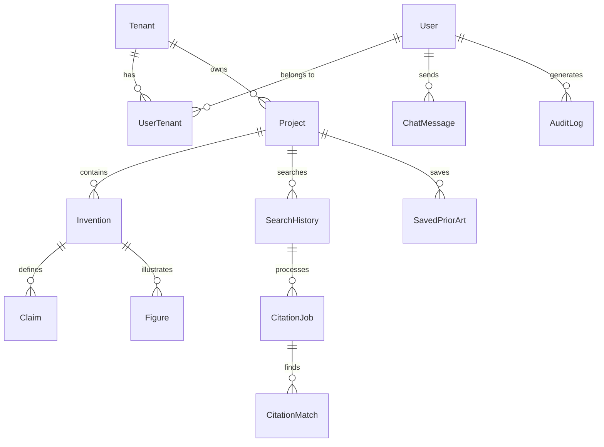

# 🗄️ Database Schema Documentation

> **Comprehensive guide to the Patent Drafter AI database structure**

## 📋 Overview

The Patent Drafter AI application uses PostgreSQL as its primary database with Prisma as the ORM. The schema is designed for multi-tenancy with strong data isolation and audit trails.

### Key Design Principles
- **Multi-Tenant Architecture**: All data is isolated by tenant
- **Soft Deletes**: Most entities support soft deletion for data recovery
- **Audit Trails**: Comprehensive logging for compliance (SOC 2)
- **Versioning**: Support for versioned data (claims, patents)
- **Type Safety**: Generated Prisma types for compile-time validation

---

## 🏢 Core Entity Relationships



---

## 👥 User & Tenant Management

### User
Core user authentication and profile information.

```prisma
model User {
  id               String    @id @default(cuid())
  auth0Id          String    @unique
  email            String    @unique
  name             String?
  picture          String?
  emailVerified    Boolean   @default(false)
  createdAt        DateTime  @default(now())
  updatedAt        DateTime  @updatedAt
  deletedAt        DateTime?
  
  // Relationships
  tenants          UserTenant[]
  chatMessages     ChatMessage[]
  auditLogs        AuditLog[]
  
  @@map("users")
}
```

**Key Points:**
- `auth0Id`: Links to Auth0 authentication
- Soft delete support via `deletedAt`
- Multi-tenant via `UserTenant` junction table

### Tenant
Organization/company isolation boundary.

```prisma
model Tenant {
  id          String    @id @default(cuid())
  name        String
  slug        String    @unique
  settings    Json      @default("{}")
  isActive    Boolean   @default(true)
  createdAt   DateTime  @default(now())
  updatedAt   DateTime  @updatedAt
  deletedAt   DateTime?
  
  // Relationships
  users       UserTenant[]
  projects    Project[]
  auditLogs   AuditLog[]
  
  @@map("tenants")
}
```

**Key Points:**
- `slug`: URL-friendly identifier for tenant routing
- `settings`: JSON configuration per tenant
- All tenant data is isolated by this ID

### UserTenant
Junction table managing user access to tenants with roles.

```prisma
model UserTenant {
  id        String      @id @default(cuid())
  userId    String
  tenantId  String
  role      TenantRole  @default(USER)
  isActive  Boolean     @default(true)
  createdAt DateTime    @default(now())
  updatedAt DateTime    @updatedAt
  
  user      User        @relation(fields: [userId], references: [id])
  tenant    Tenant      @relation(fields: [tenantId], references: [id])
  
  @@unique([userId, tenantId])
  @@map("user_tenants")
}

enum TenantRole {
  USER
  ADMIN
  INTERNAL_SERVICE
}
```

---

## 📁 Project Management

### Project
Container for patent work and inventions.

```prisma
model Project {
  id                String    @id @default(cuid())
  tenantId          String
  name              String
  description       String?
  isActive          Boolean   @default(true)
  createdAt         DateTime  @default(now())
  updatedAt         DateTime  @updatedAt
  deletedAt         DateTime?
  createdByUserId   String
  
  // Relationships
  tenant            Tenant              @relation(fields: [tenantId], references: [id])
  inventions        Invention[]
  searchHistory     SearchHistory[]
  savedPriorArt     SavedPriorArt[]
  figures           Figure[]
  exclusions        ProjectExclusion[]
  
  @@map("projects")
}
```

**Key Points:**
- Tenant-isolated via `tenantId`
- Supports soft deletion
- Tracks creation user for audit purposes

---

## 🔬 Invention & Patent Data

### Invention
Core invention data and metadata.

```prisma
model Invention {
  id                    String    @id @default(cuid())
  projectId             String
  title                 String
  summary               String?
  backgroundText        String?
  detailedDescription   String?
  technicalField        String?
  problemStatement      String?
  solution              String?
  advantages            String?
  briefDescription      String?
  isActive              Boolean   @default(true)
  createdAt             DateTime  @default(now())
  updatedAt             DateTime  @updatedAt
  deletedAt             DateTime?
  
  // Relationships
  project               Project   @relation(fields: [projectId], references: [id])
  claims                Claim[]
  figures               Figure[]
  chatMessages          ChatMessage[]
  
  @@map("inventions")
}
```

### Claim
Patent claims with versioning and dependency tracking.

```prisma
model Claim {
  id              String      @id @default(cuid())
  inventionId     String
  number          Int
  text            String
  type            ClaimType   @default(INDEPENDENT)
  dependsOn       Int?
  isActive        Boolean     @default(true)
  version         Int         @default(1)
  createdAt       DateTime    @default(now())
  updatedAt       DateTime    @updatedAt
  deletedAt       DateTime?
  
  // Relationships
  invention       Invention           @relation(fields: [inventionId], references: [id])
  history         ClaimHistory[]
  citationMatches CitationMatch[]
  
  @@unique([inventionId, number])
  @@map("claims")
}

enum ClaimType {
  INDEPENDENT
  DEPENDENT
}
```

### ClaimHistory
Version history for claim changes.

```prisma
model ClaimHistory {
  id          String    @id @default(cuid())
  claimId     String
  version     Int
  text        String
  changeType  String    // "created", "modified", "deleted"
  changedBy   String    // User ID
  createdAt   DateTime  @default(now())
  
  claim       Claim     @relation(fields: [claimId], references: [id])
  
  @@map("claim_history")
}
```

---

## 🖼️ Figure Management

### Figure
Technical drawings and images with secure storage.

```prisma
model Figure {
  id              String           @id @default(cuid())
  inventionId     String?
  projectId       String
  filename        String
  originalName    String
  mimeType        String
  size            Int
  description     String?
  blobPath        String           // Azure Blob Storage path
  isProcessed     Boolean          @default(false)
  processingStatus FigureStatus    @default(PENDING)
  uploadedBy      String           // User ID
  createdAt       DateTime         @default(now())
  updatedAt       DateTime         @updatedAt
  deletedAt       DateTime?
  
  // Relationships
  invention       Invention?       @relation(fields: [inventionId], references: [id])
  project         Project          @relation(fields: [projectId], references: [id])
  elements        FigureElement[]
  
  @@map("figures")
}

enum FigureStatus {
  PENDING
  PROCESSING
  COMPLETED
  FAILED
}
```

### FigureElement
Individual elements within figures (reference numerals).

```prisma
model FigureElement {
  id              String    @id @default(cuid())
  figureId        String
  elementNumber   String
  description     String
  xPosition       Float?
  yPosition       Float?
  isActive        Boolean   @default(true)
  createdAt       DateTime  @default(now())
  updatedAt       DateTime  @updatedAt
  
  figure          Figure    @relation(fields: [figureId], references: [id])
  
  @@map("figure_elements")
}
```

---

## 🔍 Search & Citation Management

### SearchHistory
Patent search queries and results.

```prisma
model SearchHistory {
  id                  String              @id @default(cuid())
  projectId           String
  query               String
  filters             Json                @default("{}")
  status              SearchStatus        @default(PENDING)
  resultCount         Int                 @default(0)
  results             Json?               // Search results data
  executedAt          DateTime?
  completedAt         DateTime?
  createdAt           DateTime            @default(now())
  updatedAt           DateTime            @updatedAt
  
  // Relationships
  project             Project             @relation(fields: [projectId], references: [id])
  citationJobs        CitationJob[]
  
  @@map("search_history")
}

enum SearchStatus {
  PENDING
  PROCESSING
  COMPLETED
  FAILED
}
```

### CitationJob
Background jobs for citation extraction and analysis.

```prisma
model CitationJob {
  id                    String                  @id @default(cuid())
  searchHistoryId       String
  externalJobId         String?                 // External API job ID
  status                CitationJobStatus       @default(QUEUED)
  priority              JobPriority             @default(NORMAL)
  useDeepAnalysis       Boolean                 @default(false)
  rawResultData         Json?
  processedAt           DateTime?
  completedAt           DateTime?
  errorMessage          String?
  lastCheckedAt         DateTime?
  createdAt             DateTime                @default(now())
  updatedAt             DateTime                @updatedAt
  
  // Relationships
  searchHistory         SearchHistory           @relation(fields: [searchHistoryId], references: [id])
  citationMatches       CitationMatch[]
  examinerAnalyses      ExaminerAnalysis[]
  
  @@map("citation_jobs")
}

enum CitationJobStatus {
  QUEUED
  PROCESSING
  COMPLETED
  FAILED
  CANCELLED
}

enum JobPriority {
  LOW
  NORMAL
  HIGH
}
```

### CitationMatch
Individual citations found during extraction.

```prisma
model CitationMatch {
  id                    String    @id @default(cuid())
  citationJobId         String
  claimId               String?
  publicationNumber     String
  title                 String
  abstract              String?
  relevanceScore        Float?
  matchedText           String?
  reasoning             String?
  elementOrder          Int?      // Order of matching elements
  createdAt             DateTime  @default(now())
  updatedAt             DateTime  @updatedAt
  
  // Relationships
  citationJob           CitationJob @relation(fields: [citationJobId], references: [id])
  claim                 Claim?      @relation(fields: [claimId], references: [id])
  
  @@map("citation_matches")
}
```

### SavedPriorArt
User-curated prior art references.

```prisma
model SavedPriorArt {
  id                String    @id @default(cuid())
  projectId         String
  publicationNumber String
  title             String
  abstract          String?
  claim1Text        String?   // Claim 1 text for quick reference
  summaryText       String?   // Summary for quick reference
  relevanceScore    Float?
  notes             String?
  tags              String[]
  savedBy           String    // User ID
  createdAt         DateTime  @default(now())
  updatedAt         DateTime  @updatedAt
  
  project           Project   @relation(fields: [projectId], references: [id])
  
  @@map("saved_prior_art")
}
```

---

## 💬 Chat & Communication

### ChatMessage
AI assistant conversation history.

```prisma
model ChatMessage {
  id            String      @id @default(cuid())
  userId        String
  inventionId   String?
  role          MessageRole
  content       String
  metadata      Json?       // Additional context/data
  createdAt     DateTime    @default(now())
  
  // Relationships
  user          User        @relation(fields: [userId], references: [id])
  invention     Invention?  @relation(fields: [inventionId], references: [id])
  
  @@map("chat_messages")
}

enum MessageRole {
  USER
  ASSISTANT
  SYSTEM
}
```

---

## 📊 Analysis & Reporting

### ExaminerAnalysis
AI-generated examiner-style analysis of citations.

```prisma
model ExaminerAnalysis {
  id              String      @id @default(cuid())
  citationJobId   String
  analysisType    String      // "location", "reasoning", "combined"
  analysisData    Json        // Structured analysis results
  createdAt       DateTime    @default(now())
  updatedAt       DateTime    @updatedAt
  
  citationJob     CitationJob @relation(fields: [citationJobId], references: [id])
  
  @@map("examiner_analyses")
}
```

### CombinedExaminerAnalysis
Consolidated analysis across multiple citation jobs.

```prisma
model CombinedExaminerAnalysis {
  id                String    @id @default(cuid())
  projectId         String    // Indirect relationship
  searchHistoryIds  String[]  // Array of related searches
  combinedAnalysis  Json      // Merged analysis data
  createdAt         DateTime  @default(now())
  updatedAt         DateTime  @updatedAt
  
  @@map("combined_examiner_analyses")
}
```

---

## 🔒 Security & Audit

### AuditLog
Comprehensive audit trail for compliance.

```prisma
model AuditLog {
  id            String      @id @default(cuid())
  tenantId      String?
  userId        String?
  action        String      // "CREATE", "UPDATE", "DELETE", "LOGIN", etc.
  resource      String      // "Project", "Invention", "User", etc.
  resourceId    String?     // ID of affected resource
  oldValues     Json?       // Previous values (for updates)
  newValues     Json?       // New values
  ipAddress     String?
  userAgent     String?
  sessionId     String?
  timestamp     DateTime    @default(now())
  
  // Relationships
  tenant        Tenant?     @relation(fields: [tenantId], references: [id])
  user          User?       @relation(fields: [userId], references: [id])
  
  @@map("audit_logs")
}
```

### ProjectExclusion
User-defined exclusions for prior art searches.

```prisma
model ProjectExclusion {
  id                String    @id @default(cuid())
  projectId         String
  publicationNumber String
  reason            String?
  metadata          Json?     // Additional exclusion context
  createdBy         String    // User ID
  createdAt         DateTime  @default(now())
  
  project           Project   @relation(fields: [projectId], references: [id])
  
  @@unique([projectId, publicationNumber])
  @@map("project_exclusions")
}
```

---

## 🔄 Data Migration & Versioning

### Migration Strategy
The application uses Prisma migrations for schema changes:

```bash
# Create new migration
npx prisma migrate dev --name description-of-change

# Deploy to production
npx prisma migrate deploy

# Reset database (development only)
npx prisma migrate reset
```

### Soft Delete Pattern
Most entities support soft deletion:

```typescript
// Soft delete
await prisma.project.update({
  where: { id },
  data: { deletedAt: new Date() }
});

// Exclude soft-deleted records
await prisma.project.findMany({
  where: { deletedAt: null }
});
```

---

## 📈 Performance Considerations

### Indexing Strategy
Key indexes for performance:

```sql
-- Tenant isolation (most queries filter by tenant)
CREATE INDEX idx_projects_tenant_id ON projects(tenant_id) WHERE deleted_at IS NULL;
CREATE INDEX idx_inventions_project_id ON inventions(project_id) WHERE deleted_at IS NULL;

-- Search and citation queries
CREATE INDEX idx_search_history_project_status ON search_history(project_id, status);
CREATE INDEX idx_citation_jobs_status ON citation_jobs(status, created_at);

-- User queries
CREATE INDEX idx_user_tenants_user_id ON user_tenants(user_id) WHERE is_active = true;

-- Audit queries
CREATE INDEX idx_audit_logs_tenant_timestamp ON audit_logs(tenant_id, timestamp);
```

### Query Optimization
- Use `select` to limit returned fields
- Implement pagination for large result sets
- Use `include` strategically to avoid N+1 queries
- Leverage database connection pooling

---

## 🔧 Database Operations

### Common Queries

#### Get User Projects
```typescript
const projects = await prisma.project.findMany({
  where: {
    tenantId,
    deletedAt: null,
    isActive: true
  },
  include: {
    _count: {
      select: { inventions: true }
    }
  },
  orderBy: { updatedAt: 'desc' }
});
```

#### Create Invention with Claims
```typescript
const invention = await prisma.invention.create({
  data: {
    projectId,
    title,
    summary,
    claims: {
      create: claims.map((text, index) => ({
        number: index + 1,
        text,
        type: index === 0 ? 'INDEPENDENT' : 'DEPENDENT',
        dependsOn: index === 0 ? null : 1
      }))
    }
  },
  include: { claims: true }
});
```

#### Search Citations with Pagination
```typescript
const citations = await prisma.citationMatch.findMany({
  where: {
    citationJob: {
      searchHistory: {
        projectId
      }
    }
  },
  include: {
    citationJob: {
      include: {
        searchHistory: true
      }
    },
    claim: true
  },
  skip: offset,
  take: limit,
  orderBy: { relevanceScore: 'desc' }
});
```

### Backup & Recovery
- Daily automated backups via Azure SQL Database
- Point-in-time recovery available
- Geo-redundant storage for production data
- Regular backup testing procedures

---

## 🚨 Data Integrity & Constraints

### Foreign Key Constraints
All relationships are enforced with foreign key constraints:
- Cascading deletes disabled (prefer soft deletes)
- Reference integrity maintained
- Tenant isolation enforced at database level

### Business Logic Constraints
- Claims must belong to the same tenant as their invention
- Search history tied to project tenant
- User access validated through UserTenant relationship
- File uploads restricted by tenant storage quotas

### Data Validation
- Prisma schema validation at runtime
- Custom validation in service layer
- Input sanitization at API boundaries
- File type validation for uploads

---

## 🔗 Related Documentation

- [Repository Pattern Guide](../src/repositories/README.md)
- [Data Fetching Standards](../src/lib/api/DATA_FETCHING_STANDARDS.md)
- [Security Architecture](SECURITY_ARCHITECTURE.md)
- [Prisma Documentation](https://www.prisma.io/docs/)

---

For questions about database operations or schema changes, refer to the repository files in `src/repositories/` and the Prisma schema at `prisma/schema.prisma`.