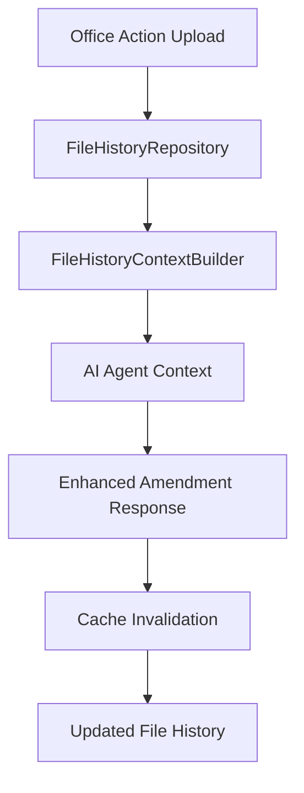

# File History Context System

## Overview

The File History Context System provides your Amendment Builder AI agent with comprehensive historical context, enabling it to think and respond like a seasoned patent attorney. By aggregating file history, claim evolution, examiner patterns, and prior argument tracking, the AI can make informed decisions based on the complete prosecution history.

## 🧠 Why This Matters

**Before**: Your AI agent responded to each Office Action in isolation, without knowledge of:
- Previous examiner arguments and responses
- Claim amendment history and reasoning
- Successful/failed argument patterns
- Examiner-specific preferences and patterns

**After**: Your AI agent now has patent attorney-level context including:
- Complete file history across all office actions and responses
- Claim evolution tracking with amendment reasoning
- Examiner pattern analysis and preference learning
- Strategic guidance based on prosecution risk assessment
- Consistency checks to avoid contradictory arguments

## 🏗️ Architecture

### Core Components

1. **[FileHistoryRepository](../src/repositories/fileHistoryRepository.ts)**: Optimized queries across office actions, responses, and claim history
2. **[FileHistoryContextBuilder](../src/server/services/file-history-context-builder.server-service.ts)**: Main service with caching and optimization
3. **[FileHistoryCacheManager](../src/server/services/file-history-cache-manager.server-service.ts)**: Cache invalidation when data changes
4. **[Enhanced AmendmentService](../src/server/services/amendment.server-service.ts)**: AI agent integration

### Data Flow



## 🚀 Usage Examples

### Basic Amendment Generation with File History

```typescript
import { AmendmentServerService } from '@/server/services/amendment.server-service';

// Generate amendment with comprehensive file history context
const amendmentResponse = await AmendmentServerService.generateAmendmentResponse({
  officeActionId: 'oa-123',
  projectId: 'project-456',
  tenantId: 'tenant-789',
  strategy: 'COMBINATION',
  userInstructions: 'Focus on distinguishing from prior art X and Y'
});
```

### Building Custom AI Context

```typescript
import { 
  FileHistoryContextBuilder,
  createComprehensiveContextOptions 
} from '@/server/services/file-history-context-builder.server-service';

// Build comprehensive context for detailed analysis
const contextOptions = createComprehensiveContextOptions('tenant-789');
const aiContext = await FileHistoryContextBuilder.buildAIAgentContext(
  'project-456',
  contextOptions
);

// Access rich context data
console.log('Prosecution Round:', aiContext.fileHistory.metadata.currentRoundNumber);
console.log('Risk Level:', aiContext.riskAssessment.overallRiskLevel);
console.log('Examiner Patterns:', aiContext.fileHistory.examinerContext.patterns);
```

### Lightweight Context for Quick Analysis

```typescript
import { createLightweightContextOptions } from '@/server/services/file-history-context-builder.server-service';

// For quick analysis without full text processing
const lightOptions = createLightweightContextOptions('tenant-789');
const context = await FileHistoryContextBuilder.buildContext('project-456', lightOptions);
```

## 📊 Context Data Structure

### File History Context

```typescript
interface FileHistoryContext {
  projectId: string;
  applicationNumber?: string;
  fileHistory: HistoricalFileEntry[];      // Chronological file history
  claimEvolution: ClaimEvolutionHistory;   // Claim amendment tracking
  examinerContext: ExaminerContext;        // Examiner patterns & preferences
  priorArgumentHistory: ArgumentHistory;   // Previous argument tracking
  metadata: FileHistoryMetadata;           // Prosecution statistics
}
```

### AI Agent Context

```typescript
interface AIAgentContext {
  fileHistory: FileHistoryContext;
  currentState: CurrentApplicationState;   // Pending deadlines, open rejections
  strategicGuidance: StrategicGuidance;    // AI-generated strategy recommendations
  riskAssessment: RiskAssessment;          // Prosecution risk analysis
}
```

## 🎯 Key Features

### 1. Examiner Pattern Learning

The system tracks examiner-specific patterns:

```typescript
// Example examiner context
{
  current: { name: "John Smith", artUnit: "2600" },
  patterns: {
    commonRejectionTypes: [
      { type: "§103", frequency: 8, typicalLanguage: [...] }
    ],
    priorArtPreferences: [
      { source: "IEEE papers", frequency: 5 }
    ]
  }
}
```

### 2. Claim Evolution Tracking

Monitors how claims change over time:

```typescript
// Example claim evolution
{
  claimNumber: 1,
  versions: [
    {
      text: "Original claim text...",
      changedAt: "2024-01-15",
      changeReason: "Overcome §103 rejection"
    }
  ],
  totalAmendments: 3
}
```

### 3. Strategic Risk Assessment

Provides prosecution risk analysis:

```typescript
// Example risk assessment
{
  overallRiskLevel: "MEDIUM",
  prosecutionRisks: [
    {
      type: "Final Rejection Risk",
      likelihood: 0.7,
      impact: 0.8,
      mitigationStrategies: ["Consider RCE", "Strong technical arguments"]
    }
  ]
}
```

## ⚡ Performance & Caching

### Intelligent Caching

- **15-minute TTL** for context data
- **LRU eviction** when cache is full
- **Project-scoped invalidation** for security
- **Automatic cleanup** when data changes

### Cache Management

```typescript
import { FileHistoryCacheManager } from '@/server/services/file-history-cache-manager.server-service';

// Invalidate when office action is uploaded
await FileHistoryCacheManager.invalidateOnOfficeActionChange(
  projectId, 
  tenantId, 
  'UPLOAD'
);

// Check cache health
const healthCheck = await FileHistoryCacheManager.performCacheHealthCheck();
```

## 🔒 Security & Tenant Isolation

### Tenant Security

- **All queries enforce tenant isolation**
- **Project access verification** before building context
- **Cache keys include tenant context**
- **No cross-tenant data leakage**

### Access Control

```typescript
// Every context build requires tenant verification
const context = await buildFileHistoryContext(projectId, {
  tenantId: 'tenant-789',  // Required for security
  // ... other options
});
```

## 🛠️ Integration Points

### Office Action Processing

```typescript
// In office action upload handler
import { invalidateOnOfficeActionChange } from '@/server/services/file-history-cache-manager.server-service';

// After office action is processed
await invalidateOnOfficeActionChange(projectId, tenantId, 'PARSE');
```

### Amendment Response Filing

```typescript
// In amendment response handler
import { invalidateOnAmendmentResponseChange } from '@/server/services/file-history-cache-manager.server-service';

// After response is filed
await invalidateOnAmendmentResponseChange(projectId, tenantId, amendmentId, 'FILE');
```

### Claim Updates

```typescript
// In claim management
import { invalidateOnClaimChange } from '@/server/services/file-history-cache-manager.server-service';

// After claims are modified
await invalidateOnClaimChange(projectId, tenantId, 'UPDATE');
```

## 📈 Quality Metrics

The system provides data quality assessment:

```typescript
interface ContextQualityMetrics {
  completeness: number;      // 0-1 score based on available data
  recency: number;          // 0-1 score based on data freshness  
  consistency: number;      // 0-1 score for data consistency
  missingDataAreas: string[]; // Areas lacking sufficient data
}
```

## 🎪 Example AI Prompt Enhancement

**Before (without file history)**:
```
Generate an amendment response for this Office Action:
- Strategy: COMBINATION
- Current Claim 1: A method comprising...
- Rejections: §103 rejection citing US123456...
```

**After (with file history context)**:
```
You are an experienced patent attorney drafting an amendment response. You have access to the complete file history and prosecution context.

## CURRENT OFFICE ACTION CONTEXT
[Current rejection details]

## FILE HISTORY CONTEXT
### Prosecution History Summary:
- Total Office Actions: 3
- Current Round: 3
- Examiner: John Smith (Art Unit 2600)

### Examiner Patterns Observed:
- §103: 8 times (frequently cites IEEE papers)
- Prefers detailed technical differentiation

### Claim Evolution History:
- Claim 1: 2 amendments (previously narrowed for §102)

### Prior Argument History:
- Previous §103 Arguments: Successfully distinguished US123456 on structural differences
- Arguments to Avoid: Broad functional arguments (rejected in Round 1)

## STRATEGIC GUIDANCE
- Overall Strategy: Focus on technical implementation details
- Build on previous successful differentiation from US123456
- Avoid functional language that failed in Round 1
- Consider continuation for broader scope

[Detailed context continues...]
```

## 🔍 Monitoring & Analytics

### Cache Statistics

```typescript
const stats = FileHistoryContextBuilder.getCacheStats();
console.log(`Cache: ${stats.size}/${stats.maxSize} entries`);
```

### Performance Monitoring

```typescript
const result = await FileHistoryContextBuilder.buildContext(projectId, options);
console.log(`Context built in ${result.buildTime}ms (cache hit: ${result.cacheHit})`);
```

## 🚨 Error Handling

The system includes comprehensive error handling:

- **Graceful degradation** when historical data is incomplete
- **Detailed logging** for debugging and monitoring
- **Non-blocking cache failures** don't break main operations
- **Data quality warnings** when context is insufficient

## 🔄 Migration & Compatibility

The enhanced amendment service maintains backward compatibility:

- **Legacy prompt method preserved** for existing integrations
- **Enhanced method available** for new implementations
- **Gradual migration path** for existing projects

## 📋 Best Practices

1. **Use appropriate context options** for your use case:
   - `createLightweightContextOptions()` for quick analysis
   - `createDefaultContextOptions()` for standard use
   - `createComprehensiveContextOptions()` for detailed analysis

2. **Monitor cache performance**:
   - Check cache hit rates
   - Monitor build times
   - Validate data quality metrics

3. **Integrate cache invalidation**:
   - Call invalidation hooks when data changes
   - Monitor cache health regularly
   - Handle invalidation failures gracefully

4. **Security considerations**:
   - Always include tenant ID in context options
   - Verify project access before building context
   - Monitor for any cross-tenant data access

## 🎯 Benefits

### For AI Agents
- **Patent attorney-level reasoning** with full prosecution context
- **Consistent argumentation** that builds on previous positions
- **Examiner-specific adaptation** based on observed patterns
- **Strategic planning** considering long-term prosecution goals

### For Developers
- **Clean service layer architecture** following established patterns
- **Comprehensive caching** for optimal performance
- **Robust error handling** with detailed logging
- **Security-first design** with tenant isolation

### For Users
- **Higher quality amendment responses** that consider full context
- **Faster response times** through intelligent caching
- **Strategic guidance** for prosecution planning
- **Risk assessment** for informed decision making

## 📚 Related Documentation

- [API Reference](../src/types/domain/file-history-context.ts) - Complete type definitions
- [Amendment Service](../src/server/services/amendment.server-service.ts) - Enhanced amendment generation
- [Repository Layer](../src/repositories/fileHistoryRepository.ts) - Data access patterns
- [Cache Management](../src/server/services/file-history-cache-manager.server-service.ts) - Cache invalidation strategies

---

The File History Context System transforms your Amendment Builder from a basic document generator into an intelligent patent prosecution assistant that thinks like an experienced attorney. By providing comprehensive historical context, it enables truly strategic, consistent, and effective amendment responses. 