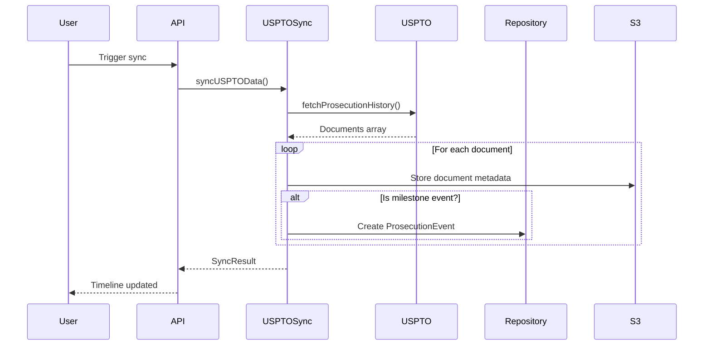

# Prosecution Timeline Architecture Guide

This guide documents the prosecution timeline architecture in Amendment Builder, providing a comprehensive reference for developers and AI agents implementing prosecution history features.

## Table of Contents
1. [Architecture Overview](#architecture-overview)
2. [Data Flow](#data-flow)
3. [Event Type System](#event-type-system)
4. [AI Automation Integration](#ai-automation-integration)
5. [Performance Optimization](#performance-optimization)
6. [Security Considerations](#security-considerations)
7. [Common Queries and Use Cases](#common-queries-and-use-cases)
8. [Migration Guide](#migration-guide)

## Architecture Overview

The prosecution timeline system tracks patent prosecution events from USPTO data, providing a unified view of the patent application lifecycle. It consists of:

### Core Components

1. **Database Layer**
   - `ProsecutionEvent` model - Stores timeline milestones
   - `PatentApplication` model - Core application data
   - `prosecutionEventRepository` - Data access with tenant isolation

2. **Service Layer**
   - `USPTOSyncService` - Syncs prosecution data from USPTO
   - `prosecutionData.server-service` - Business logic for timeline operations

3. **API Layer**
   - `/api/projects/[projectId]/timeline-events` - RESTful timeline API
   - `/api/projects/[projectId]/sync-uspto` - Sync endpoint

4. **UI Components**
   - `OATimelineWidget` - Visual timeline display
   - `ProsecutionHistoryTab` - Full prosecution view
   - Timeline hooks for data fetching

### Key Design Principles

- **Event-Driven**: Only milestone events that affect prosecution strategy
- **Tenant-Isolated**: Row-level security at repository layer
- **Performance-First**: Indexed queries, pagination, caching
- **AI-Ready**: Structured data for automated analysis

## Data Flow

### 1. USPTO Sync Flow



### 2. Timeline Display Flow

```typescript
// Frontend data flow
useEnhancedProsecutionTimeline(projectId, applicationNumber)
  → API: GET /api/projects/{projectId}/timeline-events
  → Repository: findByApplicationId() with tenant context
  → Transform: Parse metadata, sort by date
  → UI: Render timeline with interactive events
```

## Event Type System

### Core Event Types (ProsecutionEventType enum)

```typescript
enum ProsecutionEventType {
  // Filing Events
  APPLICATION_FILED = 'APPLICATION_FILED',
  CONTINUATION_FILED = 'CONTINUATION_FILED',
  
  // Office Actions - Triggers amendment workflow
  NON_FINAL_OA = 'NON_FINAL_OA',      // 6-month response clock
  FINAL_OA = 'FINAL_OA',              // 3-month statutory clock
  ADVISORY_ACTION = 'ADVISORY_ACTION',
  
  // Responses - Shows when claims were filed
  RESPONSE_FILED = 'RESPONSE_FILED',
  RCE_FILED = 'RCE_FILED',
  
  // Other Milestones
  IDS_FILED = 'IDS_FILED',                   // May restart PTA clock
  INTERVIEW_CONDUCTED = 'INTERVIEW_CONDUCTED',
  NOTICE_OF_ALLOWANCE = 'NOTICE_OF_ALLOWANCE',
  ABANDONMENT = 'ABANDONMENT',
}
```

### USPTO Document Code Mapping

The system maps USPTO document codes to event types:

```typescript
const TIMELINE_DOCUMENT_CODES = {
  // Office Actions
  'CTNF': ProsecutionEventType.NON_FINAL_OA,
  'CTFR': ProsecutionEventType.FINAL_OA,
  'CTAV': ProsecutionEventType.ADVISORY_ACTION,
  
  // Responses
  'A': ProsecutionEventType.RESPONSE_FILED,
  'A.NE': ProsecutionEventType.RESPONSE_FILED,
  'RCEX': ProsecutionEventType.RCE_FILED,
  
  // ... see constants/prosecution-events.ts for full mapping
};
```

### Event Priority System

Events have priorities for sorting and AI analysis:

```typescript
getEventPriority(eventType): number
// FINAL_OA: 10 (highest)
// NON_FINAL_OA: 9
// NOTICE_OF_ALLOWANCE: 8
// ... down to APPLICATION_FILED: 3
```

## AI Automation Integration

### 1. Timeline Analysis Helpers

```typescript
AI_TIMELINE_HELPERS.getCurrentStatus(events):
  - Determines current prosecution status
  - Calculates days since last event
  - Provides next deadline if applicable
  
AI_TIMELINE_HELPERS.getTimelineMetrics(events):
  - Total rounds of prosecution
  - Average response time
  - Has RCE/Final rejection flags
  - Overall prosecution length
  
AI_TIMELINE_HELPERS.suggestNextActions(events):
  - Deadline warnings
  - Strategic recommendations
  - Next step guidance
```

### 2. Repository AI Methods

```typescript
// Get timeline optimized for AI processing
prosecutionEventRepository.getTimelineForAnalysis(
  applicationId,
  tenantId,
  options?: {
    eventTypes?: string[];
    fromDate?: Date;
    toDate?: Date;
  }
): Promise<Array<ProsecutionEvent & { parsedMetadata?: any }>>

// Get event counts by type for summaries
prosecutionEventRepository.countByType(
  applicationId,
  tenantId
): Promise<Record<string, number>>
```

### 3. AI Tool Integration Points

```typescript
// Example AI tool for timeline analysis
const analyzeTimeline = async (projectId: string) => {
  const timeline = await prosecutionEventRepository.getTimelineForAnalysis(
    applicationId,
    tenantId
  );
  
  const status = AI_TIMELINE_HELPERS.getCurrentStatus(timeline);
  const metrics = AI_TIMELINE_HELPERS.getTimelineMetrics(timeline);
  
  // Use for amendment strategy recommendations
  if (status.status === 'PENDING_RESPONSE') {
    return generateAmendmentStrategy(timeline, metrics);
  }
};
```

## Performance Optimization

### 1. Database Indexes

```sql
-- Critical indexes for timeline queries
@@index([applicationId, eventDate])  -- Timeline fetch
@@index([eventType])                  -- Filter by type
@@index([eventDate])                  -- Date range queries
@@index([applicationId])              -- Application events
```

### 2. Query Optimization

```typescript
// Efficient pagination
const events = await prisma.prosecutionEvent.findMany({
  where: { applicationId },
  orderBy: { eventDate: 'desc' },
  skip: (page - 1) * limit,
  take: limit,
  select: {
    // Only select needed fields
    id: true,
    eventType: true,
    eventDate: true,
    title: true,
    documentId: true,
    // Avoid selecting large metadata unless needed
  }
});
```

### 3. Caching Strategy

```typescript
// React Query caching for timeline data
const queryKey = ['prosecution-timeline', projectId, applicationNumber];
const staleTime = 5 * 60 * 1000; // 5 minutes
const cacheTime = 30 * 60 * 1000; // 30 minutes

// Only refetch if data is stale or on user action
```

### 4. Bulk Operations

```typescript
// Bulk create for sync operations
prosecutionEventRepository.bulkCreate(events, tenantId)
// Uses transaction for atomicity
// Validates all applications belong to tenant
```

## Security Considerations

### 1. Tenant Isolation

```typescript
// All queries filtered by tenant at repository level
const event = await prisma.prosecutionEvent.findFirst({
  where: {
    id: eventId,
    application: {
      project: {
        tenantId: tenantId, // Enforced tenant context
      },
    },
  },
});
```

### 2. Access Control

```typescript
// API endpoint uses SecurePresets
export default SecurePresets.tenantProtected(
  TenantResolvers.fromProject,
  handler,
  {
    validate: { query: paginationSchema },
    rateLimit: 'api',
  }
);
```

### 3. Data Validation

```typescript
// Zod schemas for all inputs
const syncRequestSchema = z.object({
  force: z.boolean().optional().default(false),
});

// Event type validation
if (!Object.values(ProsecutionEventType).includes(eventType)) {
  throw new ApplicationError('Invalid event type');
}
```

## Common Queries and Use Cases

### 1. Get Current Prosecution Status

```typescript
// Get latest events to determine status
const latestOA = await prosecutionEventRepository.getLatestByType(
  applicationId,
  ProsecutionEventType.NON_FINAL_OA,
  tenantId
);

const latestResponse = await prosecutionEventRepository.getLatestByType(
  applicationId,
  ProsecutionEventType.RESPONSE_FILED,
  tenantId
);

// Status = pending if OA is newer than response
```

### 2. Calculate Response Deadlines

```typescript
const getResponseDeadline = (oaEvent: ProsecutionEvent) => {
  const deadline = new Date(oaEvent.eventDate);
  
  if (oaEvent.eventType === ProsecutionEventType.FINAL_OA) {
    deadline.setMonth(deadline.getMonth() + 2); // 2 months for final
  } else {
    deadline.setMonth(deadline.getMonth() + 3); // 3 months for non-final
  }
  
  return deadline;
};
```

### 3. Find Active Amendment Projects

```typescript
// Find projects with pending OA responses
const activeProjects = await prisma.project.findMany({
  where: {
    tenantId,
    patentApplication: {
      prosecutionEvents: {
        some: {
          eventType: { in: ['NON_FINAL_OA', 'FINAL_OA'] },
          eventDate: { gte: lastResponseDate },
        },
      },
    },
  },
});
```

### 4. Generate Prosecution Summary

```typescript
const generateSummary = async (applicationId: string) => {
  const counts = await prosecutionEventRepository.countByType(
    applicationId,
    tenantId
  );
  
  return {
    totalOfficeActions: (counts.NON_FINAL_OA || 0) + (counts.FINAL_OA || 0),
    hasRCE: counts.RCE_FILED > 0,
    currentStatus: await determineStatus(applicationId),
    responsesFiled: counts.RESPONSE_FILED || 0,
  };
};
```

## Migration Guide

### Moving from Legacy Code to Consolidated Approach

#### 1. Replace Direct Database Queries

```typescript
// ❌ OLD: Direct Prisma queries
const events = await prisma.prosecutionEvent.findMany({
  where: { applicationId }
});

// ✅ NEW: Use repository with tenant context
const events = await prosecutionEventRepository.findByApplicationId(
  applicationId,
  tenantId
);
```

#### 2. Use Event Type Constants

```typescript
// ❌ OLD: String literals
if (event.type === 'office_action') { }

// ✅ NEW: Type-safe enums
if (event.eventType === ProsecutionEventType.NON_FINAL_OA) { }
```

#### 3. Leverage AI Helpers

```typescript
// ❌ OLD: Manual status calculation
const status = events[0]?.type === 'oa' ? 'pending' : 'unknown';

// ✅ NEW: Use AI helpers
const { status, nextDeadline } = AI_TIMELINE_HELPERS.getCurrentStatus(events);
```

#### 4. Use Enhanced Timeline Hook

```typescript
// ❌ OLD: Multiple API calls
const timeline = await fetch(`/api/timeline/${projectId}`);
const documents = await fetch(`/api/documents/${projectId}`);

// ✅ NEW: Single enhanced hook
const { data: timeline } = useEnhancedProsecutionTimeline(
  projectId,
  applicationNumber
);
```

#### 5. Implement Proper Error Handling

```typescript
// ❌ OLD: Generic errors
catch (error) {
  console.error('Timeline error:', error);
}

// ✅ NEW: Structured error handling
catch (error) {
  if (error instanceof ApplicationError) {
    logger.error('[Timeline] Application error', {
      code: error.code,
      context: error.context,
    });
  }
  throw error;
}
```

### Migration Checklist

- [ ] Replace direct DB queries with repository methods
- [ ] Update event type strings to use enum constants
- [ ] Implement tenant context in all queries
- [ ] Add proper indexes to support new query patterns
- [ ] Update UI components to use enhanced timeline hooks
- [ ] Add comprehensive error handling and logging
- [ ] Test AI helper functions with production data
- [ ] Update API responses to match new format
- [ ] Document any custom event types or metadata

## Best Practices

1. **Always use repository methods** for data access to ensure tenant isolation
2. **Validate event types** against the enum to prevent invalid data
3. **Include metadata** for AI analysis but keep it structured
4. **Use bulk operations** for sync to minimize database calls
5. **Cache timeline data** appropriately based on update frequency
6. **Log all sync operations** for debugging and audit trails
7. **Handle USPTO API failures** gracefully with retry logic
8. **Test with production-like data** to ensure performance at scale

## Future Enhancements

1. **Real-time Updates**: WebSocket support for live timeline updates
2. **Advanced Analytics**: ML-based prosecution strategy predictions
3. **Examiner Insights**: Pattern analysis across examiner decisions
4. **Automated Alerts**: Deadline notifications and strategy suggestions
5. **Timeline Export**: Generate prosecution history reports
6. **Integration APIs**: Connect with docketing systems