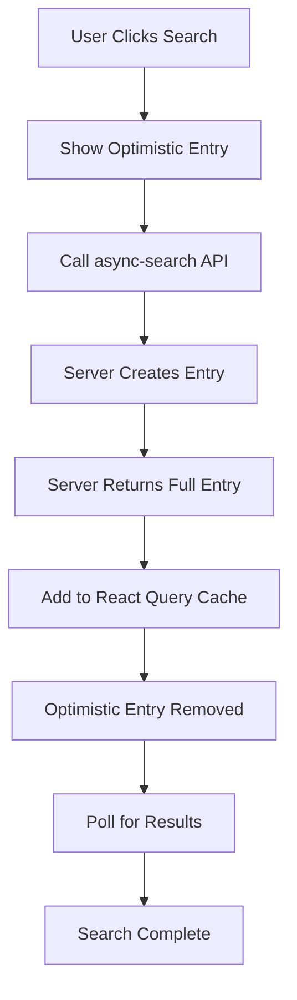

# Search Real-Time Updates - Implementation Guide

## Overview

This document explains how the search real-time updates work in the Patent Drafter AI application, including the technical implementation and the solution to race conditions.

## The Problem

When a user initiates a search, we want to:
1. Show immediate feedback (optimistic UI)
2. Display the real search entry once created
3. Update with results when the search completes
4. Handle race conditions gracefully

## The Solution - Read-After-Write Consistency

### Architecture Overview

The solution uses a **read-after-write consistency** approach:

1. **Server returns full entry**: The async-search endpoint returns the complete search history entry immediately after creation
2. **Direct cache update**: The client adds the entry directly to React Query cache
3. **Simple optimistic UI**: Shows a temporary "processing" entry that's removed when the real one appears
4. **Polling for completion**: Continues polling until search results are loaded

### Key Components

#### 1. Backend - Async Search Endpoint
```typescript
// src/pages/api/search-history/async-search.ts
const searchHistory = await createSearchHistory({...});

// Return the full entry for immediate cache update
const response = {
  searchId: searchHistory.id,
  status: 'processing',
  searchHistory: searchHistory, // Full entry included
};
```

#### 2. Frontend - Direct Cache Update
```typescript
// src/hooks/api/useSearchMutations.ts
onSuccess: async (data, variables) => {
  if (data.searchHistory) {
    // Add directly to cache - no waiting or retrying
    const currentData = queryClient.getQueryData(...) || [];
    const updatedData = [data.searchHistory, ...currentData];
    queryClient.setQueryData(..., updatedData);
  }
}
```

#### 3. Simplified Optimistic UI
```typescript
// src/features/search/hooks/useOptimisticSearch.ts
// Shows optimistic entry immediately
// Removes it when matching real entry appears
// No complex hiding/showing logic needed
```

### Benefits of This Approach

1. **Reliability**: No dependency on database read consistency timing
2. **Simplicity**: Removed complex retry logic and state management
3. **Performance**: No unnecessary API calls or delays
4. **Maintainability**: Much easier to understand and debug

### State Flow Diagram



### Comparison: Old vs New Approach

| Aspect | Old Approach | New Approach |
|--------|--------------|--------------|
| Server Response | Just searchId | Full search entry |
| Cache Update | Retry with delays | Direct update |
| Complexity | High (hiding/showing) | Low (simple replacement) |
| Race Conditions | Multiple workarounds | Eliminated at source |
| Code Lines | ~400 | ~200 |

## Implementation Details

### 1. Type Updates
Added `searchHistory` field to the async search response:
```typescript
interface StartAsyncSearchResponse {
  searchId: string;
  searchHistory?: ProcessedSearchHistoryEntry;
}
```

### 2. API Service Update
Updated the client service to handle the new response format while maintaining backward compatibility.

### 3. Hook Simplification
Removed all the complex retry logic from `useStartAsyncSearch` - now it's just a simple cache update.

### 4. Optimistic UI Simplification
The `useOptimisticSearch` hook is now much simpler:
- No hiding/showing of entries
- No complex state tracking
- Just show optimistic → remove when real appears

## Testing the Implementation

1. **Happy Path**: Click "Run new search" → See processing → See results
2. **Multiple Searches**: Run multiple searches quickly → Each appears correctly
3. **Navigation**: Navigate away and back → Search state preserved
4. **Error Cases**: Network errors → Graceful fallback

## Future Improvements

1. **WebSockets/SSE**: Replace polling with real-time updates
2. **Optimistic Results**: Show predicted results while search runs
3. **Progress Updates**: Show search progress percentage
4. **Batch Operations**: Support multiple simultaneous searches

## Troubleshooting

If searches don't appear:
1. Check network tab for the async-search response
2. Verify `searchHistory` field is populated
3. Check React Query DevTools for cache state
4. Look for console errors or warnings

## Related Files

- `/src/pages/api/search-history/async-search.ts` - Backend endpoint
- `/src/hooks/api/useSearchMutations.ts` - Search mutations hook
- `/src/features/search/hooks/useOptimisticSearch.ts` - Optimistic UI
- `/src/client/services/search.client-service.ts` - API client 