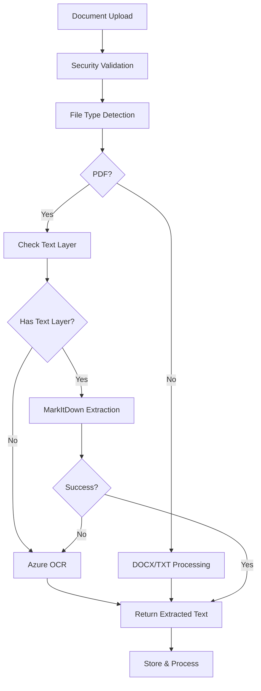

# Enhanced Text Extraction Setup Guide

The enhanced text extraction system provides intelligent document processing with OCR capabilities for scanned PDFs and image-based documents.

## Overview

The system uses a hybrid approach:

1. **Text-based PDFs**: MarkItDown for clean Markdown extraction
2. **Scanned PDFs**: Azure Computer Vision OCR
3. **DOCX files**: Mammoth (existing)
4. **TXT files**: Direct file reading

## Features

- **Intelligent routing**: Automatically detects document type and uses appropriate extraction method
- **OCR fallback**: Handles scanned PDFs and image-only documents
- **Enhanced security**: Full integration with existing security scanning and validation
- **SOC 2 compliant**: Uses Azure services with enterprise-grade security
- **Graceful degradation**: Falls back to basic extraction if enhanced methods fail

## Azure Computer Vision Setup

### Prerequisites

- Azure subscription
- Azure Computer Vision resource

### Step 1: Create Azure Computer Vision Resource

1. Go to [Azure Portal](https://portal.azure.com)
2. Navigate to **Create a resource** > **AI + Machine Learning** > **Computer Vision**
3. Fill in the required information:
   - **Subscription**: Your Azure subscription
   - **Resource group**: Create new or use existing
   - **Region**: Choose a region close to your application
   - **Name**: Unique name for your service
   - **Pricing tier**: Choose based on your needs (F0 for free tier, S1 for production)

### Step 2: Get Configuration Values

After creating the resource:

1. Go to your Computer Vision resource
2. Navigate to **Keys and Endpoint**
3. Copy the following values:
   - **Endpoint**: The full URL (e.g., `https://your-service.cognitiveservices.azure.com/`)
   - **Key 1** or **Key 2**: Either primary or secondary access key

### Step 3: Configure Environment Variables

Add the following to your `.env.local` file:

```bash
# Azure Computer Vision (OCR)
AZURE_COMPUTER_VISION_ENDPOINT=https://your-service.cognitiveservices.azure.com/
AZURE_COMPUTER_VISION_API_KEY=your-api-key-here
AZURE_COMPUTER_VISION_API_VERSION=2024-02-01
```

## Usage

The enhanced text extraction is automatically used in:

- **Office Action uploads**: Handles both text-based and scanned Office Actions
- **Patent document uploads**: Improved text extraction for reference documents
- **Any document processing**: Through the enhanced service API

### Text Extraction Flow



## Error Handling

The system provides multiple fallback levels:

1. **Enhanced extraction fails**: Falls back to basic PDF parsing
2. **Basic extraction fails**: Continues with placeholder text and warnings
3. **All extraction fails**: Upload still succeeds with clear user notification

## Security & Compliance

- **Data encryption**: All data transmitted to Azure is encrypted in transit
- **Access control**: API keys managed through Azure Key Vault (recommended)
- **Audit logging**: All OCR operations are logged for compliance
- **Data retention**: Azure Document Intelligence doesn't retain document data
- **Regional compliance**: Choose Azure regions that meet your compliance requirements

## Monitoring & Troubleshooting

### Logs

Enhanced text extraction logs include:

```typescript
[EnhancedTextExtraction] Text layer detection
[EnhancedTextExtraction] Using MarkItDown for text-based PDF
[EnhancedTextExtraction] Using Azure Document Intelligence OCR
[EnhancedTextExtraction] OCR extraction successful
```

### Common Issues

#### 1. OCR Not Working

**Symptoms**: All PDFs fall back to basic extraction
**Solutions**:
- Verify Azure Document Intelligence configuration
- Check API key and endpoint
- Ensure service is not over quota
- Verify network connectivity to Azure

#### 2. MarkItDown Not Available

**Symptoms**: Warning message "MarkItDown not available"
**Solutions**:
- Verify `markitdown` package is installed: `npm install markitdown`
- Check for import errors in logs

#### 3. Slow Performance

**Symptoms**: Document uploads taking a long time
**Solutions**:
- Consider implementing background processing
- Optimize file sizes before upload
- Monitor Azure service tier limits

### Performance Monitoring

Monitor these metrics:

- **Text extraction success rate**: Should be >95%
- **OCR usage**: Track Azure Document Intelligence quota
- **Processing time**: Monitor for performance degradation
- **Error rates**: Track fallback usage

## Cost Considerations

### Azure Document Intelligence Pricing

- **Free tier (F0)**: 500 pages/month
- **Standard tier (S0)**: Pay per page processed
- **Pricing**: Check [Azure pricing calculator](https://azure.microsoft.com/pricing/calculator/)

### Optimization Tips

1. **Use text layer detection**: Avoids unnecessary OCR costs
2. **Optimize file sizes**: Smaller files process faster and cost less
3. **Implement caching**: Cache extraction results to avoid reprocessing
4. **Monitor usage**: Set up alerts for quota limits

## Advanced Configuration

### Custom Models

For specialized document types:

```typescript
// In enhanced-text-extraction.server-service.ts
const poller = await client.beginAnalyzeDocument('your-custom-model-id', fileBuffer);
```

### Batch Processing

For high-volume scenarios:

```typescript
// Implement queue-based processing
// Use Azure Service Bus or similar for background jobs
```

### Content Filtering

Add custom filters for extracted content:

```typescript
// Post-process extracted text
const filteredText = extractedText
  .replace(/[^\w\s\.\,\;\:\!\?]/g, '') // Remove special characters
  .trim();
```

## Testing

### Unit Tests

```typescript
describe('EnhancedTextExtractionService', () => {
  it('should extract text from PDF with text layer', async () => {
    // Test with sample PDF
  });
  
  it('should use OCR for scanned PDF', async () => {
    // Test with scanned PDF sample
  });
  
  it('should fall back gracefully on errors', async () => {
    // Test error scenarios
  });
});
```

### Integration Tests

Test with various document types:
- Text-based PDFs
- Scanned PDFs
- DOCX files
- Corrupted files
- Large files

## Production Deployment

### Checklist

- [ ] Azure Document Intelligence resource created
- [ ] Environment variables configured
- [ ] API keys secured (use Key Vault)
- [ ] Monitoring and alerts set up
- [ ] Error handling tested
- [ ] Performance benchmarks established
- [ ] Cost monitoring configured

### Security Best Practices

1. **Use Managed Identity**: Avoid storing API keys in environment variables
2. **Network security**: Restrict access to Azure services
3. **Key rotation**: Regularly rotate API keys
4. **Monitoring**: Set up security alerts
5. **Compliance**: Ensure your Azure region meets compliance requirements

## Support

For issues related to:

- **Azure services**: [Azure Support](https://azure.microsoft.com/support/)
- **MarkItDown**: [Microsoft MarkItDown GitHub](https://github.com/microsoft/markitdown)
- **Application integration**: Check application logs and error messages

## Updates

The enhanced text extraction system is designed to be updated independently. Future improvements may include:

- Support for additional document formats
- Custom AI models for patent-specific content
- Improved text layer detection
- Performance optimizations 