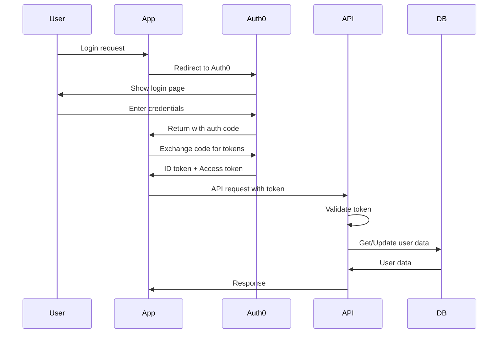

# Security Architecture

**Last Updated**: January 8, 2025

This document provides a comprehensive overview of the security architecture implemented in the Patent Drafter AI application.

## Table of Contents
- [Security Principles](#security-principles)
- [Authentication Architecture](#authentication-architecture)
- [Authorization Model](#authorization-model)
- [API Security Layers](#api-security-layers)
- [Data Protection](#data-protection)
- [Infrastructure Security](#infrastructure-security)
- [Security Monitoring](#security-monitoring)
- [Compliance & Standards](#compliance--standards)

---

## Security Principles

### Defense in Depth
Multiple layers of security controls protect against various threat vectors:

1. **Network Layer**: Azure firewall, DDoS protection
2. **Application Layer**: WAF, rate limiting, CSP
3. **API Layer**: Authentication, authorization, validation
4. **Data Layer**: Encryption, access controls, audit logs

### Zero Trust Architecture
- Never trust, always verify
- Least privilege access
- Assume breach mentality
- Continuous verification

### Security by Design
- Secure defaults in all components
- Security considered in all architectural decisions
- Regular security reviews and updates

---

## Authentication Architecture

### Current Provider: Auth0



### Session Management

#### Configuration
```typescript
{
  session: {
    rolling: true,
    absoluteDuration: 28800,    // 8 hours
    rollingDuration: 1800,      // 30 minutes
    cookie: {
      httpOnly: true,
      secure: true,
      sameSite: 'lax',
      domain: process.env.COOKIE_DOMAIN
    }
  }
}
```

#### Security Features
- HTTP-only cookies prevent XSS attacks
- Secure flag ensures HTTPS-only transmission
- SameSite protection against CSRF
- Automatic session renewal on activity
- Absolute timeout prevents indefinite sessions

### Future: IPD Identity Migration

Planned migration to internal IPD Identity system:
- OAuth2/OIDC compliant
- Corporate SSO integration
- Enhanced audit capabilities
- Unified identity management

---

## Authorization Model

### Multi-Tenant Architecture

```typescript
interface TenantContext {
  tenantId: string;
  userId: string;
  roles: string[];
  permissions: string[];
}
```

### Tenant Isolation

1. **Database Level**
   ```sql
   -- All queries include tenant filter
   SELECT * FROM projects 
   WHERE tenant_id = @tenantId 
   AND id = @projectId
   ```

2. **API Level**
   ```typescript
   // Automatic tenant injection
   const project = await projectService.get(
     projectId, 
     req.tenant.tenantId  // Injected by middleware
   );
   ```

3. **Storage Level**
   ```
   /tenants/{tenantId}/projects/{projectId}/files/
   ```

### Role-Based Access Control (RBAC)

#### Roles (Planned Implementation)
- **Tenant Owner**: Full access to tenant resources
- **Tenant Admin**: Manage users and settings
- **Patent Attorney**: Full project access
- **Patent Agent**: Limited project access
- **Viewer**: Read-only access

#### Permission Model
```typescript
enum Permission {
  // Project permissions
  PROJECT_CREATE = 'project:create',
  PROJECT_READ = 'project:read',
  PROJECT_UPDATE = 'project:update',
  PROJECT_DELETE = 'project:delete',
  
  // User management
  USER_INVITE = 'user:invite',
  USER_REMOVE = 'user:remove',
  USER_UPDATE_ROLE = 'user:update_role',
  
  // Tenant management
  TENANT_UPDATE = 'tenant:update',
  TENANT_BILLING = 'tenant:billing'
}
```

---

## API Security Layers

### SecurePresets Architecture

The application uses a centralized security pattern that provides defense-in-depth:

```typescript
// Security middleware stack (applied in order)
1. Error Handling       // Catches all errors, prevents info leakage
2. Security Headers     // X-Frame-Options, CSP, etc.
3. Rate Limiting        // Prevents abuse and DDoS
4. Authentication       // Verifies user identity
5. Session Security     // Validates session state
6. CSRF Protection      // Prevents cross-site attacks
7. Tenant Guard         // Ensures data isolation
8. Input Validation     // Validates and sanitizes input
9. Authorization        // Checks permissions (when implemented)
```

### Rate Limiting Strategy

#### Tiered Limits
```typescript
const rateLimits = {
  auth: {
    window: 5 * 60 * 1000,    // 5 minutes
    max: 5,                    // 5 attempts
    message: 'Too many login attempts'
  },
  api: {
    window: 60 * 1000,         // 1 minute
    max: 100,                  // 100 requests
    skipSuccessfulRequests: false
  },
  ai: {
    window: 5 * 60 * 1000,     // 5 minutes
    max: 20,                   // 20 AI calls
    keyGenerator: (req) => `${req.user.id}:${req.tenant.id}`
  },
  upload: {
    window: 5 * 60 * 1000,     // 5 minutes
    max: 10,                   // 10 uploads
    skipFailedRequests: true
  }
}
```

#### Implementation
- Redis-backed for distributed environments
- In-memory fallback for development
- Per-user and per-tenant limits
- Graduated response (429 with Retry-After header)

### CSRF Protection

```typescript
// Token generation
const csrfToken = crypto.randomBytes(32).toString('hex');

// Validation on state-changing operations
if (['POST', 'PUT', 'DELETE', 'PATCH'].includes(req.method)) {
  const token = req.headers['x-csrf-token'];
  if (!isValidCsrfToken(token, session)) {
    throw new ForbiddenError('Invalid CSRF token');
  }
}
```

### Input Validation

All inputs validated using Zod schemas:

```typescript
const projectSchema = z.object({
  name: z.string()
    .min(1)
    .max(255)
    .regex(/^[a-zA-Z0-9\s\-_]+$/),
  description: z.string()
    .max(1000)
    .optional(),
  metadata: z.record(z.unknown())
    .optional()
});

// Automatic validation in SecurePresets
SecurePresets.tenantProtected(handler, {
  validation: {
    body: projectSchema,
    query: querySchema
  }
});
```

---

## Data Protection

### Encryption

#### At Rest
- **Database**: Azure SQL TDE (Transparent Data Encryption)
- **File Storage**: Azure Storage Service Encryption
- **Backups**: Encrypted with customer-managed keys

#### In Transit
- **TLS 1.2+** enforced for all connections
- **HSTS** header with 1-year max-age
- **Certificate pinning** for critical services (planned)

### Data Sanitization

```typescript
// HTML sanitization for user content
import DOMPurify from 'isomorphic-dompurify';

const sanitized = DOMPurify.sanitize(userInput, {
  ALLOWED_TAGS: ['b', 'i', 'em', 'strong', 'a'],
  ALLOWED_ATTR: ['href']
});

// SQL injection prevention via Prisma
const results = await prisma.$queryRaw`
  SELECT * FROM projects 
  WHERE tenant_id = ${tenantId}
  AND name LIKE ${searchTerm + '%'}
`;
```

### File Upload Security

1. **Type Validation**
   ```typescript
   const allowedTypes = [
     'application/pdf',
     'application/msword',
     'image/png',
     'image/jpeg'
   ];
   ```

2. **Size Limits**
   ```typescript
   const maxSizes = {
     document: 50 * 1024 * 1024,  // 50MB
     image: 10 * 1024 * 1024,      // 10MB
   };
   ```

3. **Malware Scanning**
   ```typescript
   const scanResult = await malwareScanner.scan(file);
   if (scanResult.hasVirus) {
     await quarantine(file);
     throw new SecurityError('Malicious file detected');
   }
   ```

4. **Storage Isolation**
   - Tenant-specific containers
   - Signed URLs for access
   - Expiring download links

---

## Infrastructure Security

### Network Security
- **VNet isolation** for backend services
- **Private endpoints** for database access
- **WAF** rules for common attacks
- **DDoS protection** at network edge

### Secret Management
```typescript
// Environment variable validation
const requiredSecrets = [
  'DATABASE_URL',
  'AUTH0_SECRET',
  'OPENAI_API_KEY',
  'SESSION_SECRET'
];

// Startup validation
validateEnvironment(requiredSecrets);

// No secrets in code
// No secrets in logs
// Rotation reminders via monitoring
```

### Container Security
- **Base image**: Distroless or Alpine
- **Non-root user** execution
- **Read-only filesystem** where possible
- **Security scanning** in CI/CD

### Deployment Security
```yaml
# Kubernetes security policies
apiVersion: policy/v1beta1
kind: PodSecurityPolicy
spec:
  runAsUser:
    rule: MustRunAsNonRoot
  seLinux:
    rule: RunAsAny
  fsGroup:
    rule: RunAsAny
  volumes:
  - 'configMap'
  - 'secret'
  - 'emptyDir'
  - 'persistentVolumeClaim'
```

---

## Security Monitoring

### Audit Logging

#### Events Logged
```typescript
enum SecurityEvent {
  LOGIN_SUCCESS = 'auth.login.success',
  LOGIN_FAILURE = 'auth.login.failure',
  LOGOUT = 'auth.logout',
  SESSION_EXPIRED = 'auth.session.expired',
  
  ACCESS_DENIED = 'access.denied',
  TENANT_SWITCH = 'tenant.switch',
  
  RATE_LIMIT_EXCEEDED = 'security.rate_limit',
  CSRF_FAILURE = 'security.csrf_failure',
  
  FILE_UPLOAD = 'file.upload',
  FILE_DOWNLOAD = 'file.download',
  FILE_MALWARE_DETECTED = 'file.malware',
  
  DATA_EXPORT = 'data.export',
  DATA_DELETE = 'data.delete',
  
  ADMIN_ACTION = 'admin.action'
}
```

#### Log Format
```json
{
  "timestamp": "2025-01-08T10:30:00Z",
  "eventType": "auth.login.success",
  "userId": "user123",
  "tenantId": "tenant456",
  "ipAddress": "203.0.113.1",
  "userAgent": "Mozilla/5.0...",
  "correlationId": "req-789",
  "metadata": {
    "provider": "auth0",
    "mfaUsed": true
  }
}
```

### Real-time Alerts

```typescript
// Alert conditions
const alertRules = [
  {
    name: 'Multiple failed logins',
    condition: 'count(auth.login.failure) > 5 in 5m by userId',
    severity: 'medium'
  },
  {
    name: 'Privilege escalation attempt',
    condition: 'access.denied with admin route',
    severity: 'high'
  },
  {
    name: 'Data exfiltration',
    condition: 'sum(file.download.size) > 1GB in 1h by userId',
    severity: 'high'
  }
];
```

### Security Metrics

#### Key Performance Indicators
- Authentication success rate
- Average session duration
- Rate limit violations per endpoint
- Failed authorization attempts
- File scan results (clean vs infected)
- API response times by security preset
- CSRF token validation success rate

#### Security Dashboard
- Real-time threat indicators
- User behavior analytics
- Compliance status
- Vulnerability scan results

---

## Compliance & Standards

### SOC2 Type II Compliance
- **Access Control**: Multi-factor authentication, role-based access
- **Audit Logging**: Comprehensive security event logging
- **Encryption**: Data encrypted at rest and in transit
- **Monitoring**: 24/7 security monitoring (planned)
- **Incident Response**: Documented procedures

### GDPR Compliance
- **Consent Management**: Explicit user consent for data processing
- **Data Portability**: Export user data in standard formats
- **Right to Erasure**: Complete data deletion capabilities
- **Privacy by Design**: Security built into architecture
- **Data Minimization**: Only collect necessary data

### Security Standards
- **OWASP Top 10**: Protection against common vulnerabilities
- **CIS Controls**: Implementation of critical security controls
- **ISO 27001**: Information security management practices
- **NIST Cybersecurity Framework**: Risk management approach

### Regular Security Activities
1. **Security Reviews**: Quarterly architecture reviews
2. **Penetration Testing**: Annual third-party testing
3. **Vulnerability Scanning**: Automated weekly scans
4. **Security Training**: Developer security awareness
5. **Incident Drills**: Quarterly response exercises

---

## Security Contacts

- **Security Team**: security@patentdrafter.ai
- **Vulnerability Disclosure**: security+disclosure@patentdrafter.ai
- **Incident Response**: Available 24/7 via PagerDuty

For security concerns, please use encrypted communication where possible.