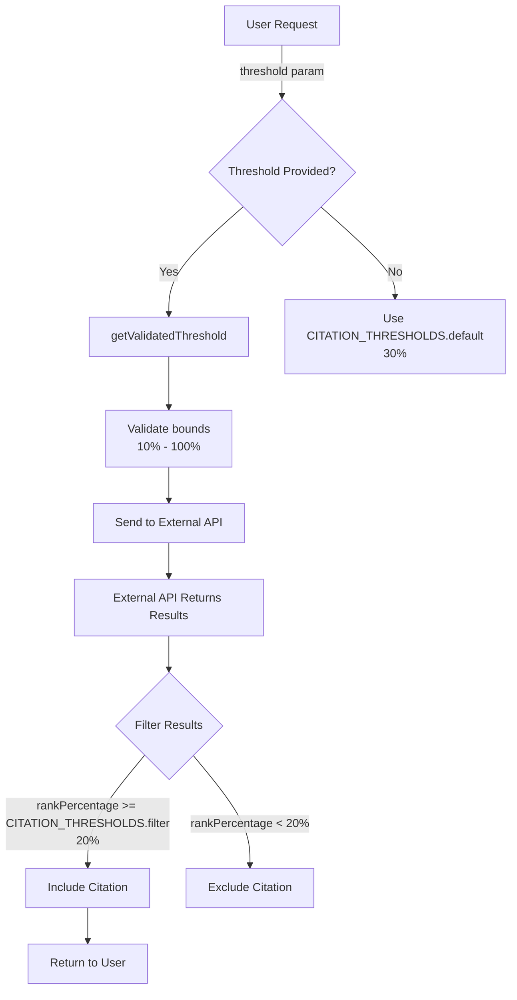

# Citation Extraction System Architecture

## Overview

The citation extraction system is designed to maintain historical accuracy by storing the exact claim elements used during each extraction. This ensures that citation results always reflect the state of the claims at the time of extraction, not the current state.

## Key Concepts

### 1. Element Storage

Each `CitationMatch` record in the database stores:
- `parsedElementText`: The exact text of the claim element at the time of extraction
- `referenceNumber`: The patent reference this citation was extracted from
- `citation`: The actual citation text found
- Other metadata (scores, reasoning, etc.)

**Important**: The parsed element text is "frozen in time" - it represents what the element was when the extraction ran, not what it currently is.

### 2. Grouping and Display

The system groups citations by their `parsedElementText` field:

```typescript
// From the API endpoint
serializedMatches.forEach(match => {
  const elementText = match.parsedElementText || 'Unknown Element';
  
  if (!groupedByElement[elementText]) {
    groupedByElement[elementText] = {
      elementText,
      matches: [],
    };
  }
  
  groupedByElement[elementText].matches.push(match);
});
```

This means:
- Only elements that have citations will appear in the table
- Each reference badge may show different elements (based on what was extracted)
- Elements are shown exactly as they were at extraction time

### 3. Element Ordering

The `parsedElements` prop passed to `CitationsTabContainer` is used ONLY for sorting:

```typescript
// Sort the filtered groups by the order of parsedElements if provided
const visibleMatches = useMemo((): GroupedCitation[] => {
  if (!parsedElements || parsedElements.length === 0) {
    return filteredMatches;
  }

  const orderMap = new Map<string, number>();
  parsedElements.forEach((el, idx) => {
    if (el && typeof el === 'string') {
      orderMap.set(el.trim(), idx);
    }
  });

  return [...filteredMatches].sort((a, b) => {
    const idxA = orderMap.has(a.elementText) 
      ? orderMap.get(a.elementText)! 
      : Number.MAX_SAFE_INTEGER;
    const idxB = orderMap.has(b.elementText) 
      ? orderMap.get(b.elementText)! 
      : Number.MAX_SAFE_INTEGER;
    return idxA - idxB;
  });
}, [filteredMatches, parsedElements]);
```

This ensures elements appear in a logical order when possible, but doesn't add or remove elements.

## Common Misconceptions

### ❌ "All elements should always show in the table"
**Reality**: Only elements that have citation matches in the database will show. If an element had no citations found, it won't appear.

### ❌ "Editing parsed elements deletes old results"
**Reality**: Each citation extraction is independent. Changing current parsed elements doesn't affect historical extractions - they maintain their own element text.

### ❌ "The same elements should show for every reference"
**Reality**: Different references may have been extracted with different parsed elements. Each extraction captures the state at that moment.

## Data Flow

1. **Extraction Request**: Current parsed elements are sent to the citation extraction service
2. **Processing**: For each element, the system finds up to 2 top citations
3. **Storage**: Each citation match is stored with the exact element text
4. **Display**: When viewing results, citations are grouped by their stored element text
5. **Sorting**: If current parsed elements are provided, they're used to sort the groups

## Best Practices

1. **Don't expect all elements to show**: Only elements with citations will appear
2. **Understand temporal nature**: Each extraction is a snapshot in time
3. **Use reference badges**: Different badges may show different elements based on when they were extracted
4. **Element text is immutable**: Once extracted, the element text in citations won't change

## Technical Implementation

### Key Files

- `src/pages/api/citation-matches/by-search/[id].ts`: Groups matches by `parsedElementText`
- `src/features/citation-extraction/components/CitationsTabContainer.tsx`: Displays grouped citations
- `src/features/search/utils/citationUtils.ts`: Utilities for grouping and sorting
- `src/server/services/citation-processing.server-service.ts`: Stores element text with each match

### Database Schema

```prisma
model CitationMatch {
  id                String   @id @default(uuid())
  parsedElementText String?  @db.NVarChar(Max)  // Stores exact element text
  citation          String   @db.NVarChar(Max)
  referenceNumber   String
  // ... other fields
}
```

## Future Considerations

If you need to show all elements (including those without citations):

1. **Option 1**: Store a separate record of which elements were used for each extraction
2. **Option 2**: Create empty citation matches for elements with no results
3. **Option 3**: Use a different UI pattern that shows extraction metadata separately

Currently, the system is optimized for showing only elements that have actual citations, which provides a cleaner, more focused user experience.

# Citation Extraction Feature

## Overview

The citation extraction feature searches for relevant patent citations that match claim elements. It uses an external API to find citations and applies confidence thresholds to ensure quality results.

## Threshold System

The system uses two threshold levels:

### 1. **API Request Threshold** (Default: 30%)
- Controls what minimum confidence level we request from the external citation API
- Configurable via `CITATION_DEFAULT_THRESHOLD` environment variable
- Used when submitting requests to the external service
- Lower values = more results but potentially less relevant

### 2. **Filter Threshold** (Default: 20%)
- Applied after receiving results to filter out low-quality matches
- Configurable via `CITATION_FILTER_THRESHOLD` environment variable
- Ensures users don't see citations below this confidence level
- Acts as a safety net to remove noise

## Configuration

All citation thresholds are centralized in:
- **Environment Config**: `src/config/environment.ts` (citation section)
- **Citation Config**: `src/config/citationExtractionConfig.ts`

### Environment Variables

```bash
# Default threshold for API requests (percentage)
CITATION_DEFAULT_THRESHOLD=30

# Minimum allowed threshold
CITATION_MIN_THRESHOLD=10

# Maximum allowed threshold  
CITATION_MAX_THRESHOLD=100

# Post-processing filter threshold
CITATION_FILTER_THRESHOLD=20
```

### Using Thresholds in Code

```typescript
import { CITATION_THRESHOLDS, getValidatedThreshold } from '@/config/citationExtractionConfig';

// Get default threshold
const defaultThreshold = CITATION_THRESHOLDS.default;

// Validate user input
const validThreshold = getValidatedThreshold(userInput);
```

## Adding UI Controls (Future Enhancement)

To add threshold selection to the UI:

1. Import the preset configurations:
```typescript
import { THRESHOLD_PRESETS } from '@/config/citationExtractionConfig';
```

2. Add a select/slider component:
```typescript
<Select value={threshold} onChange={setThreshold}>
  {THRESHOLD_PRESETS.map(preset => (
    <option key={preset.value} value={preset.value}>
      {preset.label}
    </option>
  ))}
</Select>
```

3. Pass the threshold to the citation job:
```typescript
createCitationJobMutation.mutateAsync({
  searchId,
  referenceNumber,
  threshold, // User-selected threshold
});
```

## Data Flow



## Key Files

- **Configuration**: `/src/config/citationExtractionConfig.ts`
- **API Service**: `/src/server/services/citation-extraction-inline.server.service.ts`
- **Result Filtering**: `/src/features/citation-extraction/utils/citation-utils.ts`
- **UI Hook**: `/src/features/citation-extraction/hooks/useCitationsTabLogic.ts`

## Best Practices

1. **Always use the configuration constants** instead of hardcoding thresholds
2. **Validate thresholds** using `getValidatedThreshold()` before sending to API
3. **Log threshold values** in debug logs for troubleshooting
4. **Consider the trade-off**: Lower thresholds = more results but lower quality

## Troubleshooting

### Few or No Citations Found
- Check if threshold is too high (try lowering to 20-30%)
- Verify the patent being searched contains relevant content
- Check logs for filtered citations below threshold

### Too Many Low-Quality Citations
- Increase the threshold (try 40-60%)
- Consider raising `CITATION_FILTER_THRESHOLD` environment variable

### Threshold Not Taking Effect
- Verify environment variables are loaded correctly
- Check that code is using `CITATION_THRESHOLDS` constants
- Ensure API requests include the threshold parameter
